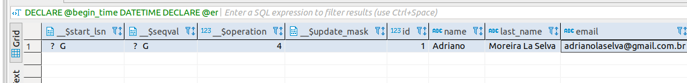

# Habilitar CDC no SQL Server.

Este tutorial tem por objetivo mostrar de forma prática como habilitar o CDC (change data capture) no SQL Server.

Esta publicação faz parte da série de publicações que pretendo fazer sobre técnicas de ETL (extract-transform and load) e persistência poliglota, seja para construção de Datalakes ou para utilização de plataformas de Full-Text Search (ElasticSearch, Apache Solr).

## Criação de banco de dados

```sql
create database example_cdc
```

## Criação tabela para testes

```sql
create table users(
	id integer identity,
	name varchar(90) not null,
	last_name varchar(90) not null,
	email varchar(90) not null,
	unique(email),
	primary key(id)
)
```

## Habilitar CDC para o banco de dados

```sql
USE example_cdc
EXEC sys.sp_cdc_enable_db  
```

## Desabilitar CDC para o banco de dados

```sql
USE example_cdc
EXEC sys.sp_cdc_disable_db
```

## Habilitar CDC para uma tabela do banco de dados

```sql
USE example_cdc
EXEC sys.sp_cdc_enable_table  
@source_schema = N'dbo',  
@source_name   = N'users',  
@role_name     = NULL,
@supports_net_changes = 1  
```

## Desabilitar CDC para uma tabela do banco de dados

```sql
USE example_cdc
EXEC sys.sp_cdc_disable_table  
@source_schema = N'dbo',  
@source_name   = N'users',
@capture_instance = N'dbo_users'
```

## Validar se o CDC esta habilitado para o banco de dados

```sql
select is_cdc_enabled,* from sys.databases where name in ('example_cdc')
```


## Configuração de tempo em que um log fica armazenado

No CDC há um processo de limpeza automática que é executado em intervalos regulares. O padrão de intervalo é de 3 dias, no entanto é possível configura-lo de forma diversa. Observamos que, quando ativamos o CDC no banco de dados, um procedimento adicional é habilitado no sistema -sys.sp_cdc_cleanup_change_table - limpando todos os dados rastreados fora do intervalo.

```sql
USE example_cdc
EXEC sys.sp_cdc_cleanup_change_table   
  @capture_instance='dbo_users',   
  @low_water_mark=NULL,  
  @threshold=5000
```

## Functions de consultas de alterações

```sql
DECLARE @begin_time DATETIME;
DECLARE @end_time DATETIME;
DECLARE @begin_lsn BINARY(10); 
DECLARE @end_lsn BINARY(10);

SELECT @begin_time = GETDATE()-1, @end_time = GETDATE();
SELECT @begin_lsn = sys.fn_cdc_map_time_to_lsn('smallest greater than', @begin_time); 
SELECT @end_lsn = sys.fn_cdc_map_time_to_lsn('largest less than or equal', @end_time);

SELECT * FROM example_cdc.cdc.fn_cdc_get_all_changes_dbo_users(@begin_lsn,@end_lsn,'all') 
```




## Schema gerado para armazenar os logs de alterações na base de dados


## Functions, procedures e tabelas geradas por schema quando habilitado o CDC


## Exemplo de function gerada para obter os dados através do CDC


## Fluxo de captura


## Ressalvas

No caso do SQL Server as informações ficam armazenadas utilizando tabelas para armazenar os logs e não arquivos. A utilização de tabela deve se dar com cautela, pois se o banco de dados já se encontrar com baixa performance habilitando o CDC você pode gerar problemas maiores.


## Conclusão

Acredito que numa base de dados que já possui problemas de performance (muitas vezes pelo excesso de normalização dos dados) esta abordagem deve ser aplicada com extrema cautela. Importante também levar em conta que, por se tratar de um banco de dados relacional que apenas escala de forma vertical, o preço e a mão de obra de infra-estrutura podem aumentar, chegando ao limite da tecnologia (limite de hardware), o que tornaria inviável a manutenção da infra-estrutura.

## Referências

- [Habilitar e desabilitar o Change Data Capture (SQL Server)](https://docs.microsoft.com/pt-br/sql/relational-databases/track-changes/enable-and-disable-change-data-capture-sql-server?view=sql-server-2017)
- [Sobre o change data capture (SQL Server)](https://docs.microsoft.com/pt-br/sql/relational-databases/track-changes/about-change-data-capture-sql-server?view=sql-server-2017)
- [Tabelas Change Data Capture (Transact-SQL)](https://docs.microsoft.com/pt-br/sql/relational-databases/system-tables/change-data-capture-tables-transact-sql?view=sql-server-2017)
- [Procedimentos armazenados de captura de dados de alteração (Transact-SQL)](https://docs.microsoft.com/pt-br/sql/relational-databases/system-stored-procedures/change-data-capture-stored-procedures-transact-sql?view=sql-server-2017)
