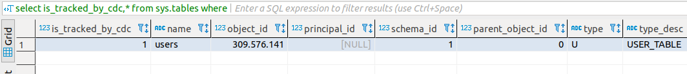

# Habilitar change data capture SqlServer

## Criação de banco de dados

```sql
create database example_cdc
```

## Criação tabela para testes

```sql
create table users(
	id integer identity,
	name varchar(90) not null,
	last_name varchar(90) not null,
	email varchar(90) not null,
	unique(email),
	primary key(id)
)
```

## Habilitar CDC para o banco de dados

```sql
USE example_cdc
EXEC sys.sp_cdc_enable_db  
```

## Desabilitar CDC para o banco de dados

```sql
USE example_cdc
EXEC sys.sp_cdc_disable_db
```

## Habilitar CDC para uma tabela do banco de dados

```sql
USE example_cdc
EXEC sys.sp_cdc_enable_table  
@source_schema = N'dbo',  
@source_name   = N'users',  
@role_name     = NULL,
@supports_net_changes = 1  
```

## Desabilitar CDC para uma tabela do banco de dados

```sql
USE example_cdc
EXEC sys.sp_cdc_disable_table  
@source_schema = N'dbo',  
@source_name   = N'users',
@capture_instance = N'dbo_users'
```

## Validar se o CDC esta habilitado para o banco de dados

```sql
select is_cdc_enabled,* from sys.databases where name in ('example_cdc')
```


## Validar se a CDC esta habilitado para a tabela do banco de dados

```sql
select is_tracked_by_cdc,* from sys.tables where name in ('users')
```




## Resalvas

- No caso do Sqlserver as informações ficam armazenadas não utilizando logs a nível de arquivo, e sim a nível de tabelas, neste caso, sendo assim deve ser utilizado com cautela, pois se o banco de dados já se encontra com baixa performance habilitando o cdc você pode estar gerando outros problemas maiores.


