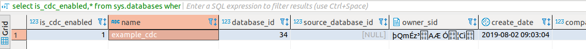
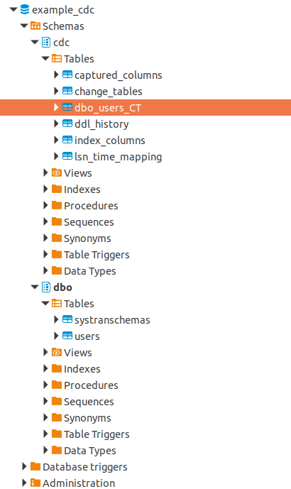
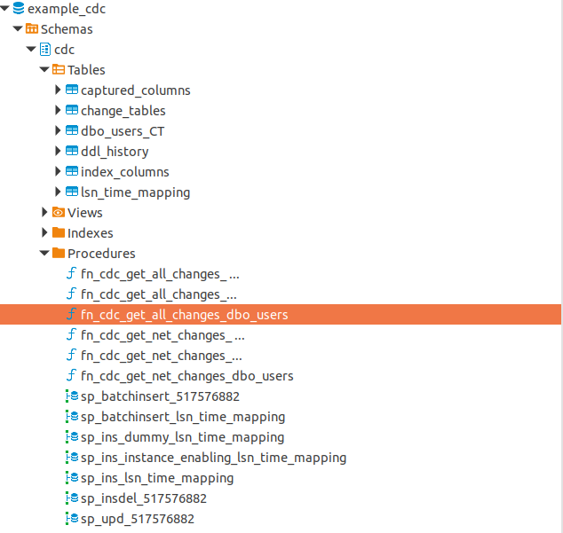
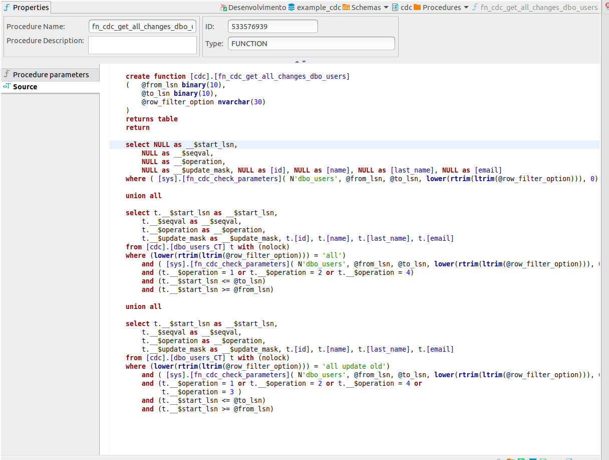
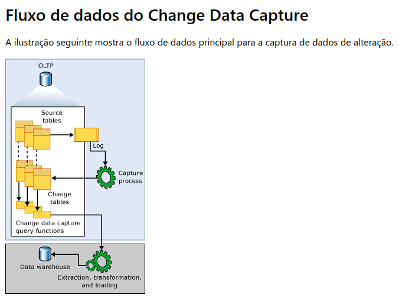
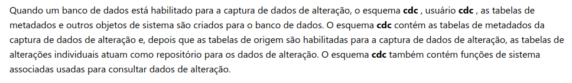

# Habilitar change data capture no SqlServer para uso de estratégia de estrangulamento na migração de sistemas legados.

## Criação de banco de dados

```sql
create database example_cdc
```

## Criação tabela para testes

```sql
create table users(
	id integer identity,
	name varchar(90) not null,
	last_name varchar(90) not null,
	email varchar(90) not null,
	unique(email),
	primary key(id)
)
```

## Habilitar CDC para o banco de dados

```sql
USE example_cdc
EXEC sys.sp_cdc_enable_db  
```

## Desabilitar CDC para o banco de dados

```sql
USE example_cdc
EXEC sys.sp_cdc_disable_db
```

## Habilitar CDC para uma tabela do banco de dados

```sql
USE example_cdc
EXEC sys.sp_cdc_enable_table  
@source_schema = N'dbo',  
@source_name   = N'users',  
@role_name     = NULL,
@supports_net_changes = 1  
```

## Desabilitar CDC para uma tabela do banco de dados

```sql
USE example_cdc
EXEC sys.sp_cdc_disable_table  
@source_schema = N'dbo',  
@source_name   = N'users',
@capture_instance = N'dbo_users'
```

## Validar se o CDC esta habilitado para o banco de dados

```sql
select is_cdc_enabled,* from sys.databases where name in ('example_cdc')
```




## Schema gerado para armazenar os logs de alterações na base de dados



## Functions, procedures e tabelas geradas por schema quando habilitado o CDC



## Exemplo de function gerada para obter os dados atravéz do CDC



## Fluxo de dados do Change Data Capture

A ilustração seguinte mostra o fluxo de dados principal para a captura de dados de alteração.




## Resalvas

- No caso do Sqlserver as informações ficam armazenadas não utilizando logs a nível de arquivo, e sim a nível de tabelas, neste caso, sendo assim deve ser utilizado com cautela, pois se o banco de dados já se encontra com baixa performance habilitando o cdc você pode estar gerando outros problemas maiores.




## Conclusão

Na minha humilde opinião o CDC deve ser utilizado com parcimônia, pois se a base de dados já possui problemas de performance, o mesmo tende aumentar, dado que os dados são armazenados utilizando do próprio SGBC, e o volume de escritas aumenta de forma exponencial. Ou Seja, em uma base de dados que já possui problemas de performance, muitas vezes pelo excesso de normalização dos dados esta abordagem deve ser aplicada com extrema cautela. Outro ponto é que por um banco relacional apenas escala de forma vertical, dado este cenário, o preço e a mão de obra de infra-estrutura tente a aumentar até chegar ao limite da tecnologia (limite de hardware) e tornar inviável manter a infra-estrutura.


## Referências


- [Habilitar e desabilitar o Change Data Capture (SQL Server)](https://docs.microsoft.com/pt-br/sql/relational-databases/track-changes/enable-and-disable-change-data-capture-sql-server?view=sql-server-2017)

- [Sobre o change data capture (SQL Server)](https://docs.microsoft.com/pt-br/sql/relational-databases/track-changes/about-change-data-capture-sql-server?view=sql-server-2017)

- [Tabelas Change Data Capture (Transact-SQL)](https://docs.microsoft.com/pt-br/sql/relational-databases/system-tables/change-data-capture-tables-transact-sql?view=sql-server-2017)


